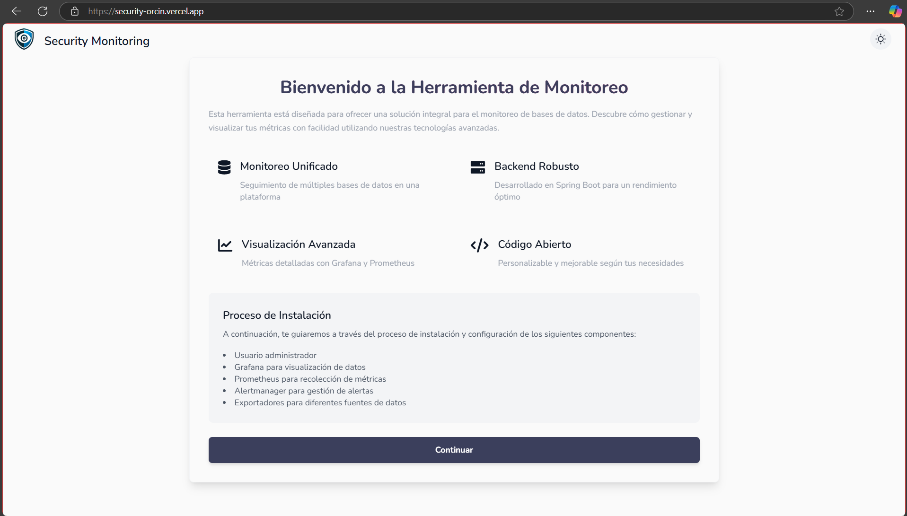
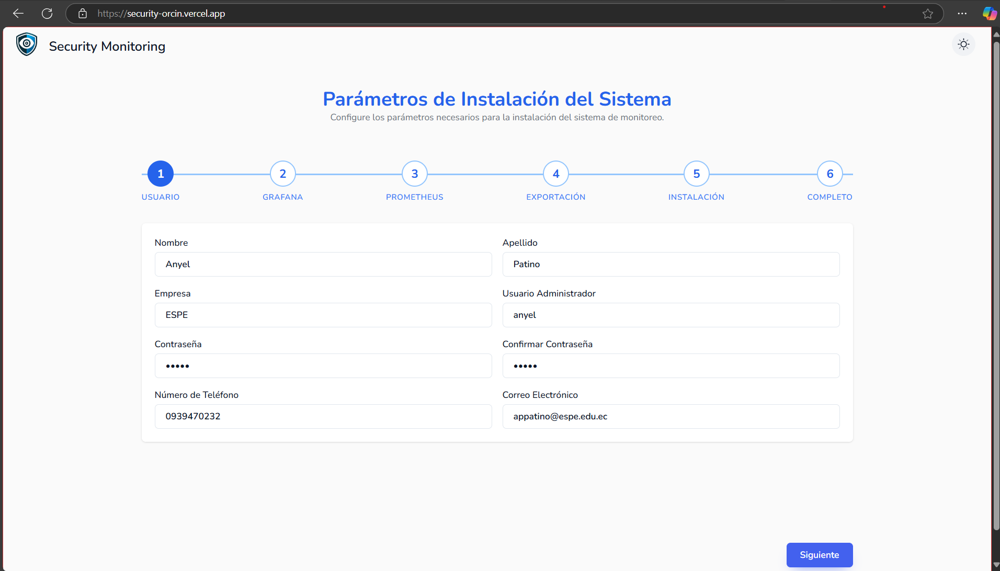
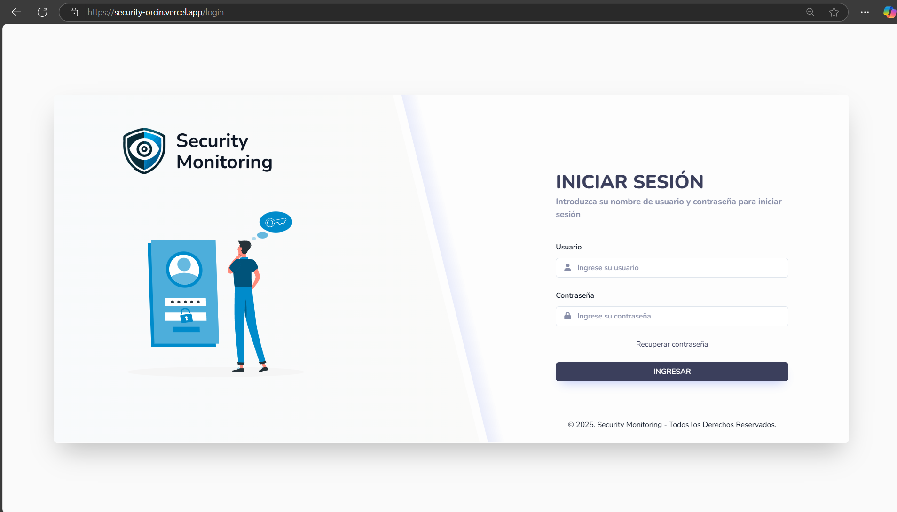
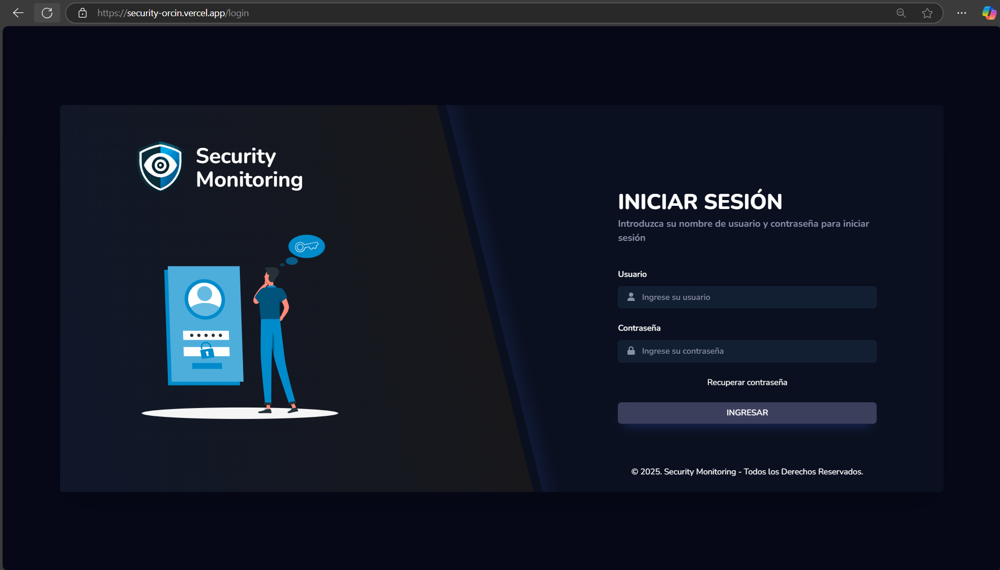
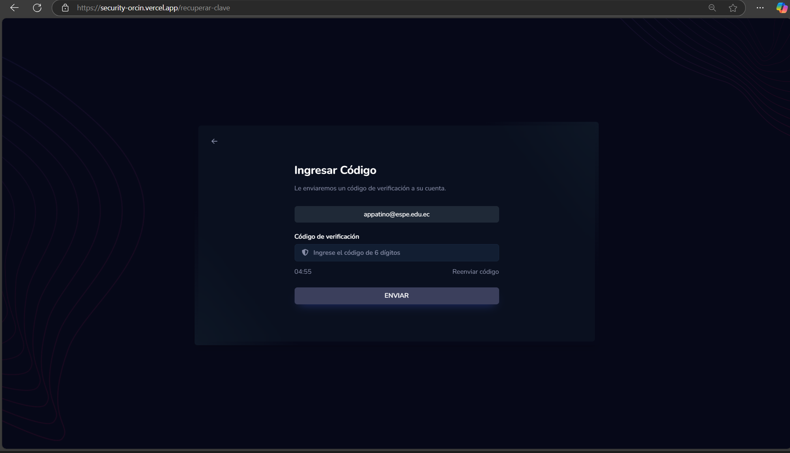
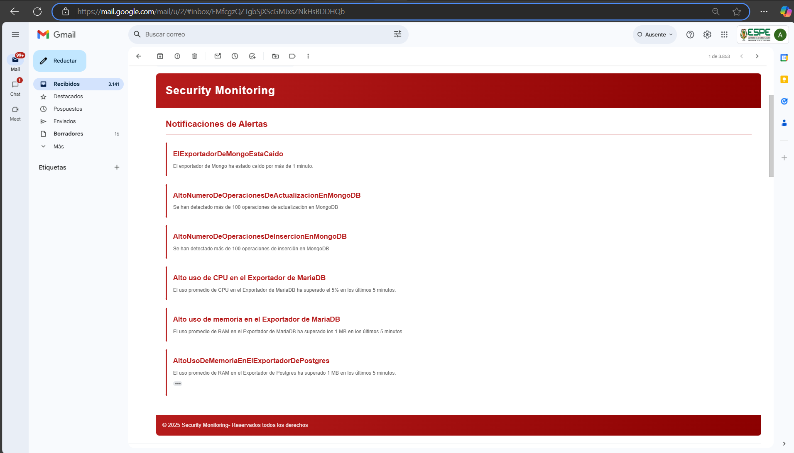
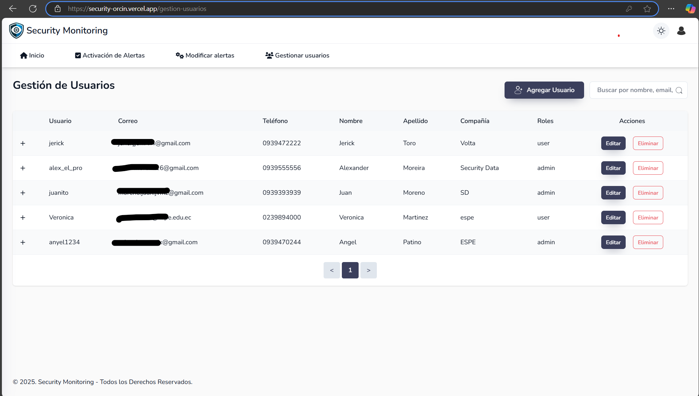
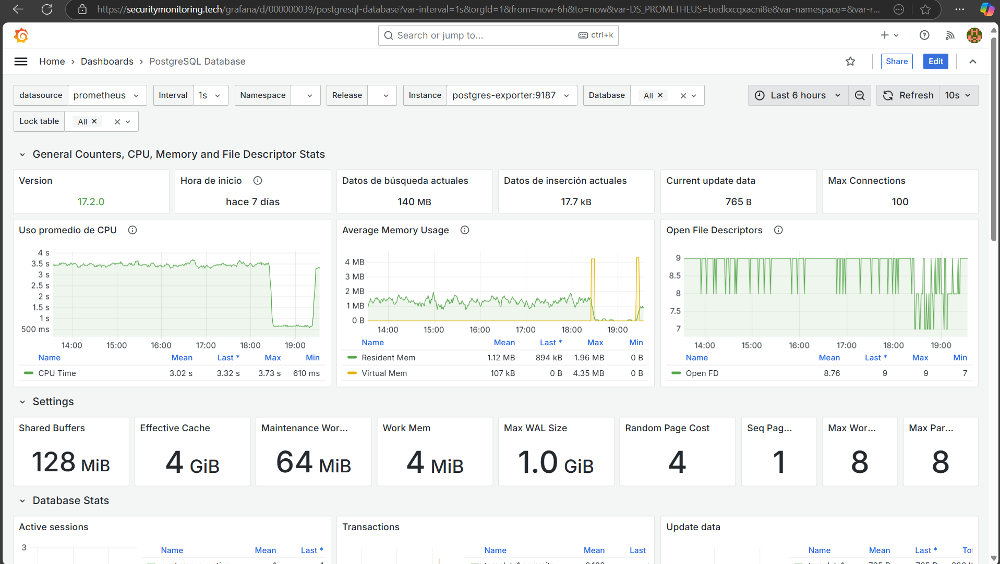
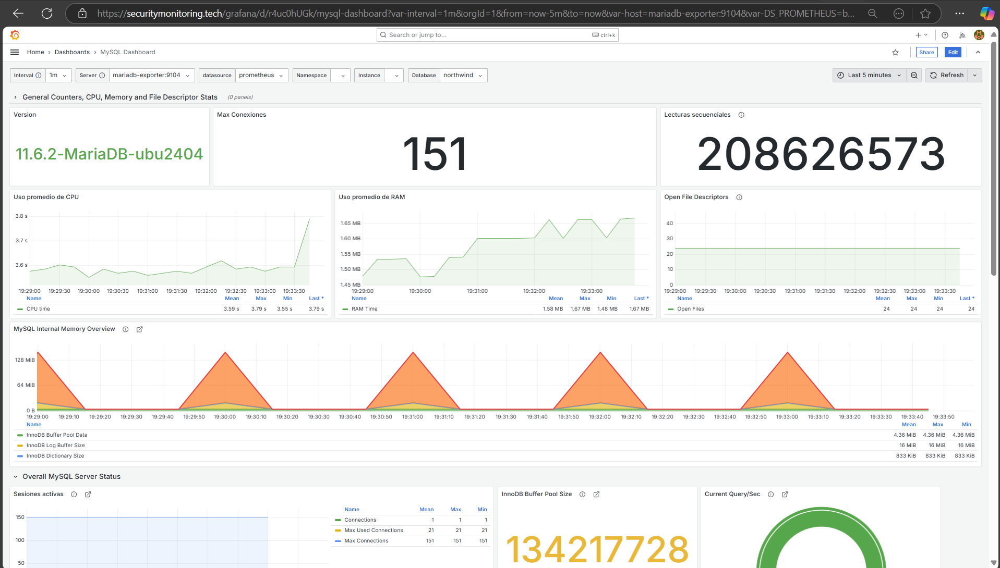
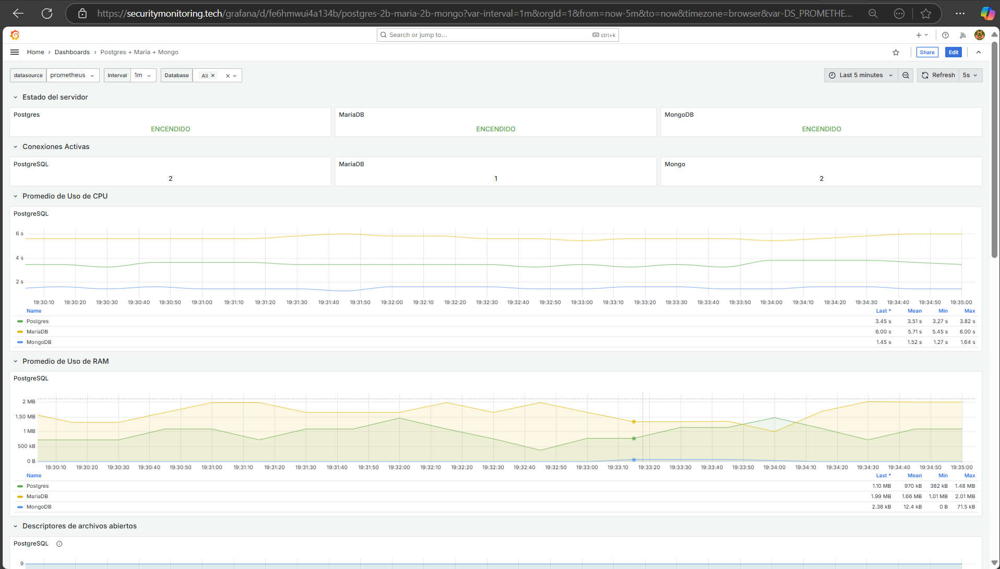

# Herramienta Open Source para el Monitoreo de Bases de Datos MariaDB, PostgreSQL y MongoDB con Prometheus y Grafana  

Este proyecto tiene como objetivo desarrollar una herramienta **open-source** para el monitoreo dinámico de tres bases de datos: **MongoDB**, **PostgreSQL** y **MariaDB/MySQL**. La herramienta permite a los usuarios especificar credenciales de conexión a través de una interfaz web en **React** y visualizar paneles personalizados en **Grafana** para una o varias bases de datos combinadas.  

El backend está desarrollado con **Spring Boot** y utiliza **Prometheus** y **Grafana** para recopilar y visualizar las métricas de las bases de datos seleccionadas.  

## **Select Language:**
- [Español (Spanish)](README-es.md)
- [English](README.md)

## Características  

1. **Configuración de Conexión a Bases de Datos**:  
   - Los usuarios pueden especificar credenciales para conectar **MongoDB**, **PostgreSQL** y **MariaDB** a través de un formulario dinámico en la aplicación React.  
   - Permite la combinación de diferentes bases de datos: por ejemplo, monitorear solo **MongoDB**, **PostgreSQL** o **MariaDB**, o combinaciones como **MongoDB + PostgreSQL**.  

2. **Monitoreo Dinámico**:  
   - El backend en **Spring Boot** recibe las credenciales proporcionadas por el usuario y configura las conexiones a la base de datos.  
   - Se recopilan métricas con **Prometheus** y se visualizan en **Grafana**.  

3. **Visualización en Grafana**:  
   - Dashboards preconfigurados en **Grafana** que se activan según las bases de datos seleccionadas por el usuario.  

4. **Envío de notificaciones**:  
   - Envío de notificaciones mediante **Alertmanager**.  

## Resultados  
### Bienvenido  
  

### Instalación del usuario administrador, Grafana, Prometheus y demás complementos  
  

### Inicio de sesión  
  

### Inicio de sesión (Modo oscuro)  
  

### Recuperar contraseña (Modo oscuro)  
  

### Gestión de credenciales de los Sistemas de Gestión de BD  
  

### Activación de alertas para los Sistemas de Gestión de BD  
  

### Modificación de alertas  
  

### Envío de alertas al cumplirse reglas  
  

### Gestión de usuarios  
  

### Gestión de usuarios (todo el sistema compatible con modo oscuro)  
  

### Creación de usuarios  
  

### Recepción de correo de creación de usuarios  
  

### Paneles de control en Grafana - PostgreSQL  
  

### Paneles de control en Grafana - MariaDB/MySQL  
  

### Paneles de control en Grafana - MongoDB  
  

### Paneles de control en Grafana - MongoDB + MariaDB/MySQL + PostgreSQL  



## Tecnologías Utilizadas  

- **Frontend**: React (creado con Vite), React Bootstrap para el diseño de formularios dinámicos.  
- **Backend**: Spring Boot (en desarrollo).  
- **Monitoreo y Visualización**: Grafana y Prometheus.  
- **Sistemas de Gestion de Bases de Datos**: MongoDB, PostgreSQL y MariaDB.  
- **Contenedores**: Docker y Docker Compose para la orquestación de servicios.  

## Instalación y Uso  

### 1. Clonar el Repositorio  

```bash
git clone https://github.com/Anyel-ec/SecurityMonitoring
cd SecurityMonitoring
```  


## Contribuciones  

Si deseas contribuir a este proyecto, puedes abrir un **issue** o enviar un **pull request**.  

## Licencia  

Este proyecto está licenciado bajo la [Licencia Apache 2.0](LICENSE).  

## Equipo e Información del Proyecto  

Herramienta open source para el monitoreo dinámico de tres bases de datos: **MongoDB**, **PostgreSQL** y **MariaDB/MySQL**.  

**Gerente del Proyecto: Ing. Luis Chica, Mgtr** - [Perfil de GitHub](https://github.com/LuisChica18)  

**Desarrollador: Ing. Angel Patiño** - [Perfil de GitHub](https://github.com/Anyel-ec)  

---

Déjame saber si necesitas algún ajuste. 🚀