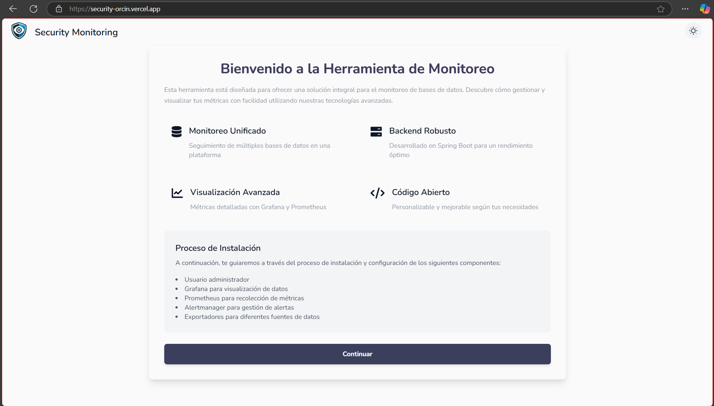
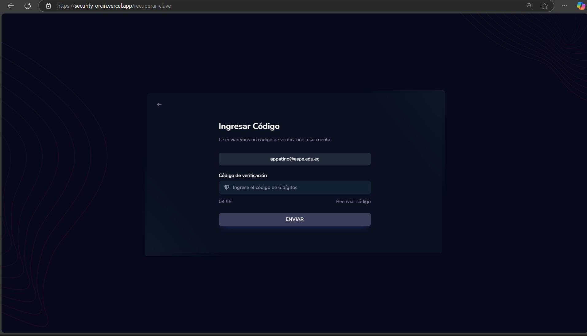
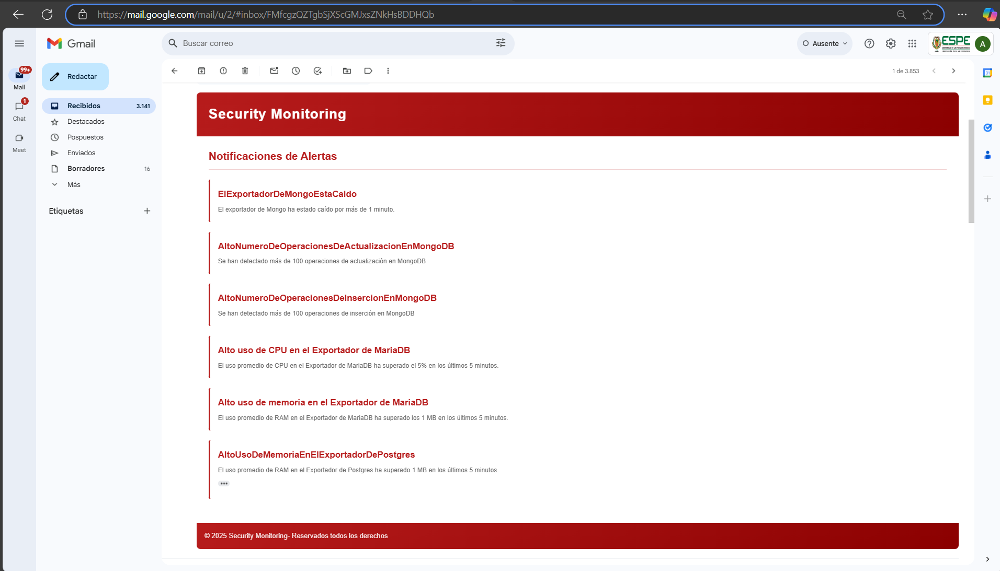
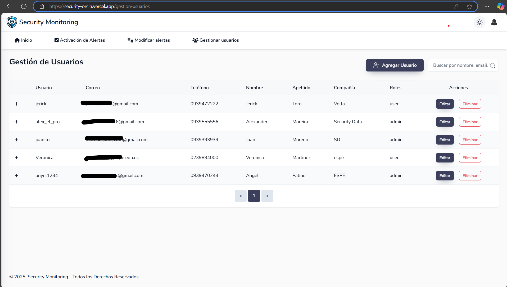
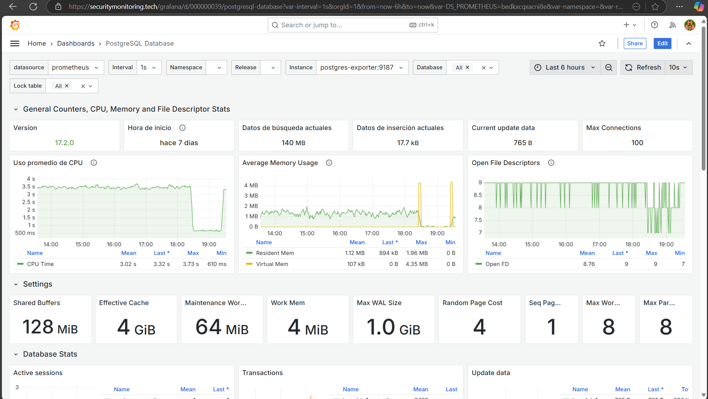
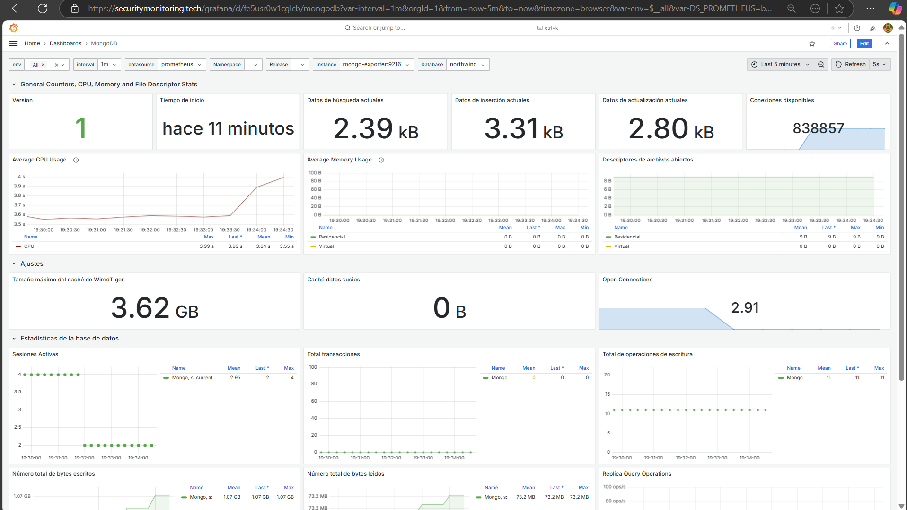
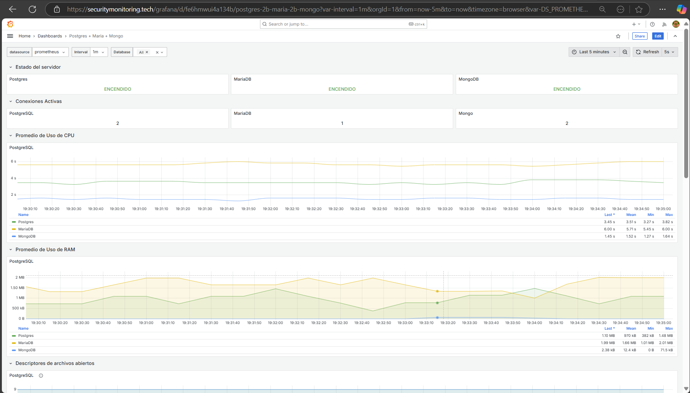

# Open Source Tool for Monitoring MariaDB, PostgreSQL, and MongoDB Databases with Prometheus and Grafana  

This project aims to develop an **open-source** tool for the dynamic monitoring of three databases: **MongoDB**, **PostgreSQL**, and **MariaDB/MySQL**. The tool allows users to specify connection credentials through a **React** web interface and view personalized dashboards in **Grafana** for one or multiple combined databases.  

The backend is developed using **Spring Boot** and leverages **Prometheus** and **Grafana** to collect and visualize metrics from the selected databases.  

## **Select Language:**
- [Español (Spanish)](README-es.md)
- [English](README.md)

## Features  

1. **Database Connection Configuration**:  
   - Users can specify credentials to connect **MongoDB**, **PostgreSQL**, and **MariaDB** via a dynamic form in the React application.  
   - Supports combinations of different databases: for example, monitoring only **MongoDB**, **PostgreSQL**, or **MariaDB**, or combinations such as **MongoDB + PostgreSQL**.  

2. **Dynamic Monitoring**:  
   - The **Spring Boot** backend receives the credentials provided by the user and configures the database connections.  
   - Metrics are collected with **Prometheus** and visualized in **Grafana**.  

3. **Grafana Visualization**:  
   - Preconfigured **Grafana** dashboards that activate according to the databases selected by the user.  

4. **Notification Sending**:  
   - Notifications are sent using **Alertmanager**.  

## Results  
### Welcome  
  

### Installation of admin user, Grafana, Prometheus, and other components  
  

### Login  
  

### Login (Dark mode)  
  

### Password recovery (Dark mode)  
  

### Credential management for Database Management Systems  
  

### Alert activation for Database Management Systems  
  

### Alert modification  
  

### Alert notifications triggered by rule conditions  
  

### User management  
  

### User management (full system supports dark mode)  
  

### User creation  
  

### User creation email received  
  

### Grafana Dashboards - PostgreSQL  
  

### Grafana Dashboards - MariaDB/MySQL  
  

### Grafana Dashboards - MongoDB  
  

### Grafana Dashboards - MongoDB + MariaDB/MySQL + PostgreSQL  


---

## Installation and Usage

### 1. Clone the Repository

```bash
git clone https://github.com/Anyel-ec/SecurityMonitoring
cd SecurityMonitoring
```

### 2. Run the Services with Docker Compose

```bash
docker-compose up -d
```

This will launch the following services:
- **Grafana**: Accessible at `http://localhost:3000` (username: `admin`, password: `admin`).
- **Prometheus**: Accessible at `http://localhost:9090`.
- **PostgreSQL Exporter**: Accessible at `http://localhost:9187`.

### 3. Configure Grafana

1. Access **Grafana** at `http://localhost:3000`.
2. Log in using the credentials (`admin/admin`).
3. Add **Prometheus** as a data source:
   - URL: `http://prometheus:9090`.
4. Import the relevant dashboard to visualize the metrics for the configured databases.

### 4. Next Steps

The next step in development is to improve the integration with the databases, as well as automate the creation of dashboards in Grafana.

## Contributions

If you wish to contribute to this project, please open an issue or submit a pull request.

## License

This project is licensed under the [Apache License 2.0](LICENSE).

## Team and Project Information

Open source tool service for dynamic monitoring of three DBMS: MongoDB, PostgreSQL, and MariaDB/MySQL.

**Project Manager: Ing. Luis Chica, Mgtr** - [GitHub Profile](https://github.com/LuisChica18)

**Developer: Ing. Angel Patiño** - [GitHub Profile](https://github.com/Anyel-ec)